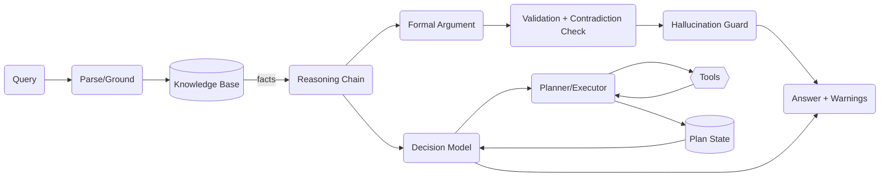
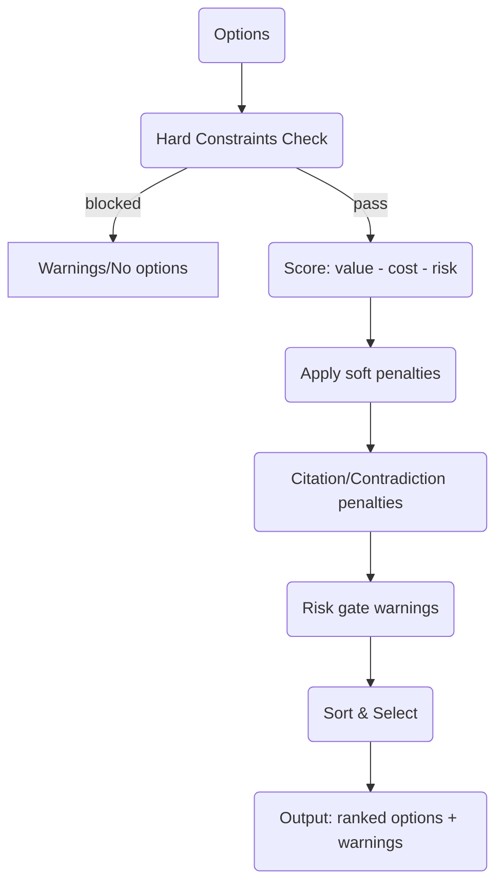
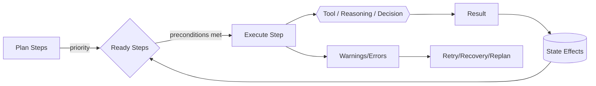
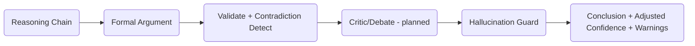

# Agent Architecture Views

Visual summaries of the current and intended agent stack. These reflect the existing code (reasoning agent, decision model, planner with preconditions/effects, memory, critic/hallucination guard) and the planned integration noted in the roadmap.

## End-to-End Reasoning Flow



## Decision Model Scoring Pipeline



## Planner with Preconditions/Effects and State



## Validation, Critic, and Hallucination Guard



## WG Alignment (Future Intent)

```mermaid
flowchart TD
    SHARED[Shared Agent Logic & Config (future package)]
    SHARED --> QS[Quickstarts Agents]
    SHARED --> WGBE[WG Local Backend (planned)]
    WGBE --> WGFE[WG Front-End]
    WGFE --> USERS(Users/Tests)
```
