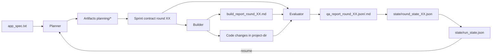

# Autonomous Coding Harness (V3.5.2)

Harness d’automatisation de développement basé sur un cycle **Planner → Builder → Evaluator**, avec artefacts JSON validés par schéma, reprise de session (`--resume`) et garde-fous QA/sécurité.

> 📌 Le détail des évolutions par version est désormais dans `CHANGELOG.md` (et **plus** dans ce README).

## 1) Objectif du projet

Ce projet sert à piloter un cycle de développement autonome sur un dossier cible (`--project-dir`) en :
- planifiant le travail,
- implémentant des changements,
- évaluant les résultats avec critères d’acceptation,
- conservant un état durable pour reprendre sans perdre le contexte.

Le flux est pensé pour des itérations multi-rounds avec contrats de sprint explicites et reporting QA structuré.

## 2) Schéma de fonctionnement



## 3) Architecture (modules clés)

- `autonomous_agent_demo.py` : point d’entrée CLI (modes, flags, orchestration runtime).  
- `orchestrator.py` : boucle de rounds, reprise, progression, création contrats de sprint.  
- `planner.py` : production des artefacts de planification.  
- `builder.py` : exécution implémentation + rapport de build.  
- `evaluator.py` : QA finale, statut pass/fail/blocked.  
- `artifacts.py` : chemins d’artefacts + validation de schémas JSON.  
- `client.py` et `security.py` : configuration SDK, sandbox, permissions outils, hooks Bash.  
- `state_models.py` : modèles de l’état d’exécution.

## 4) Prérequis obligatoires

## 4.1 Linux

- Python **3.10+** recommandé.
- `pip` disponible.
- `npx` (Node.js) recommandé pour les outils MCP navigateur (Playwright/Puppeteer).
- Clé API Anthropic: `ANTHROPIC_API_KEY` (sauf mode `--dry-run`).

Vérification rapide :

```bash
python3 --version
pip --version
npx --version
```

## 4.2 Windows (PowerShell)

- Python **3.10+** recommandé.
- `pip` fonctionnel.
- Node.js (pour `npx`) recommandé.
- Variable d’environnement `ANTHROPIC_API_KEY` (sauf `--dry-run`).

Vérification rapide :

```powershell
python --version
pip --version
npx --version
```

## 5) Installation

Depuis la racine du repo :

```bash
pip install -r autonomous-coding/requirements.txt
```

Dépendances principales :
- `claude-code-sdk`
- `jsonschema`
- `pytest`

## 6) Configuration

### 6.1 Variables d’environnement

Linux/macOS :

```bash
export ANTHROPIC_API_KEY="votre_cle"
```

Windows PowerShell :

```powershell
$env:ANTHROPIC_API_KEY="votre_cle"
```

### 6.2 Fichiers importants à connaître

- `prompts/app_spec.txt` : spec applicative de base copiée dans le projet cible pour initialiser le contexte produit.
- `artifacts/qa_report_template.json` : exemple/template de structure de rapport QA.
- `schemas/*.schema.json` : contrats JSON officiels (run state, backlog, contrat sprint, QA, etc.).
- `.claude_settings.json` (généré dans `--project-dir`) : sandbox + permissions outils autorisés.

> Le “fichier JSON pour commencer” auquel on pense souvent est en pratique le couple :
> - `planning/work_backlog.json` (généré par le Planner),
> - et les schémas dans `schemas/` qui imposent la structure.

## 7) Utilisation détaillée

Commande de base :

```bash
python autonomous-coding/autonomous_agent_demo.py --project-dir ./my_project
```

Le dossier effectif est normalisé sous `generations/` quand un chemin relatif est fourni.

### 7.1 Commandes principales

- Exécution standard :

```bash
python autonomous-coding/autonomous_agent_demo.py --project-dir ./my_project
```

- Reprise d’un run existant :

```bash
python autonomous-coding/autonomous_agent_demo.py --project-dir ./my_project --resume
```

- Dry-run (sans appel LLM distant) :

```bash
python autonomous-coding/autonomous_agent_demo.py --project-dir ./my_project --dry-run
```

- Planification uniquement :

```bash
python autonomous-coding/autonomous_agent_demo.py --project-dir ./my_project --planner-only
```

- QA uniquement :

```bash
python autonomous-coding/autonomous_agent_demo.py --project-dir ./my_project --qa-only
```

- Activer la revue de contrat assistée LLM :

```bash
python autonomous-coding/autonomous_agent_demo.py --project-dir ./my_project --llm-contract-review
```

### 7.2 Flags CLI (résumé)

- `--project-dir` : dossier du projet cible.
- `--mode {v3_1,v2,v1}` : runtime (v2 est alias déprécié).
- `--model` : même modèle pour toutes les phases.
- `--planner-model` / `--builder-model` / `--evaluator-model` : override par phase.
- `--max-rounds` : nombre max de rounds.
- `--max-iterations` : uniquement mode v1.
- `--resume` : reprendre sur l’état existant.
- `--dry-run` : test orchestration sans API live.
- `--planner-only` / `--qa-only` : exécution partielle.
- `--llm-contract-review` : arbitrage modèle côté négociation de contrat.

## 8) Artefacts produits

Dans `--project-dir` (souvent `generations/<nom>`):

- `planning/expanded_spec.md`
- `planning/architecture.md`
- `planning/acceptance_criteria.json`
- `planning/work_backlog.json`
- `planning/sprint_contract_round_XX.json`
- `planning/sprint_contract_negotiation_round_XX.json`
- `builder/build_report_round_XX.md`
- `qa/qa_report_round_XX.json`
- `qa/qa_report_round_XX.md`
- `state/round_state_XX.json`
- `state/run_state.json`

## 9) Fonctionnalités couvertes

- Orchestration multi-phase (planner/builder/evaluator).
- Contrats de sprint explicites par round.
- Négociation de contrat avec raison structurée (`reason_codes`, etc.).
- Validation schéma JSON des artefacts.
- Reprise de run robuste via état persistant.
- Telemetry token/coût (estimation best-effort).
- Garde-fous sécurité (sandbox + permissions + hooks Bash).
- Support outillage navigateur MCP (Playwright prioritaire, Puppeteer fallback).

## 10) Tests et validation efficaces

Exécuter les tests unitaires/intégration locale :

```bash
pytest autonomous-coding/tests autonomous-coding/test_security.py autonomous-coding/test_security_hook.py -q
```

Tester le flux complet sans coûts API :

```bash
python autonomous-coding/autonomous_agent_demo.py --project-dir ./smoke_demo --dry-run
```

Vérifier la cohérence des artefacts JSON :
- inspecter les fichiers sous `state/`, `planning/`, `qa/`,
- confirmer l’alignement avec `schemas/*.schema.json`.

## 11) Dépannage rapide

- **`ANTHROPIC_API_KEY` absent** : requis hors `--dry-run`.
- **Erreurs de schéma JSON** : valider les artefacts contre `schemas/*.schema.json`.
- **Run bloqué en reprise** : vérifier `state/run_state.json` et le dernier `state/round_state_XX.json`.
- **QA navigateur indisponible** : vérifier Node.js/`npx` et l’exécution MCP.

## 12) Bonnes pratiques d’exploitation

- Toujours démarrer par une spec claire dans `app_spec.txt`.
- Garder `work_backlog.json` et critères d’acceptation concis et testables.
- Favoriser `--dry-run` pour valider la tuyauterie avant run live.
- Utiliser `--resume` plutôt que relancer de zéro pour préserver la traçabilité.
