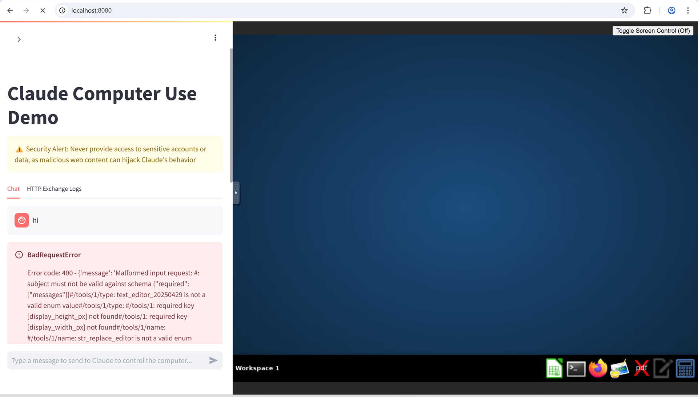

# Bug Fix: Invalid Tool Type Names in Computer Use Demo

## Issue Summary

The Anthropic Computer Use Demo was failing with `BadRequestError` due to invalid tool type names being sent to the Anthropic API. This prevented users from successfully interacting with Claude in the computer use environment.

## Error Details

### Error Screenshot

*Screenshot showing the BadRequestError when trying to interact with Claude in the computer use demo*

### Original Error Message
```
BadRequestError

Error code: 400 - {'message': 'Malformed input request: #: subject must not be valid against schema {"required":["messages"]}#/tools/1/type: text_editor_20250429 is not a valid enum value#/tools/1/type: #/tools/1: required key [display_height_px] not found#/tools/1: required key [display_width_px] not found#/tools/1/name: #/tools/1/name: str_replace_editor is not a valid enum value#/tools/1/type: #/tools/1/type: text_editor_20250429 is not a valid enum value#/tools/1/name: #/tools/1/name: str_replace_editor is not a valid enum value#/tools/1/type: #/tools/1/type: text_editor_20250429 is not a valid enum value#/tools/1: required key [input_schema] not found#/tools/1/type: expected: null, found: String#/tools/1/type: #/tools/1/type: text_editor_20250429 is not a valid enum value#/tools/2/name: #/tools/2/name: bash is not a valid enum value#/tools/2/type: bash_20250124 is not a valid enum value#/tools/2/type: #/tools/2: required key [display_height_px] not found#/tools/2: required key [display_width_px] not found#/tools/2/name: #/tools/2/name: bash is not a valid enum value#/tools/2/type: #/tools/2/type: bash_20250124 is not a valid enum value#/tools/2/type: #/tools/2/type: bash_20250124 is not a valid enum value#/tools/2: required key [input_schema] not found#/tools/2/type: expected: null, found: String#/tools/2/type: #/tools/2/type: bash_20250124 is not a valid enum value, please reformat your input and try again.'}
```

### Error Location
The error occurred in `/home/computeruse/computer_use_demo/loop.py` at line 139 when making API calls to Anthropic.

## Root Cause Analysis

The issue was caused by incorrect API type definitions in the tool classes:

1. **EditTool20241022**: Used invalid type `text_editor_20250429` instead of `text_editor_20241022`
2. **BashTool20241022**: Used invalid type `bash_20250124` instead of `bash_20241022`

These invalid type names were not recognized by the Anthropic API, causing the request validation to fail.

## Files Affected

1. `computer_use_demo/tools/edit.py`
2. `computer_use_demo/tools/bash.py`

## Solution

### Fix 1: EditTool20241022 API Type
**File**: `computer_use_demo/tools/edit.py`

**Before**:
```python
class EditTool20241022(EditTool20250124):
    api_type: Literal["text_editor_20250429"] = "text_editor_20250429"  # pyright: ignore[reportIncompatibleVariableOverride]
```

**After**:
```python
class EditTool20241022(EditTool20250124):
    api_type: Literal["text_editor_20241022"] = "text_editor_20241022"  # pyright: ignore[reportIncompatibleVariableOverride]
```

### Fix 2: BashTool20241022 API Type
**File**: `computer_use_demo/tools/bash.py`

**Before**:
```python
class BashTool20241022(BashTool20250124):
    api_type: Literal["bash_20250124"] = "bash_20250124"  # pyright: ignore[reportIncompatibleVariableOverride]
```

**After**:
```python
class BashTool20241022(BashTool20250124):
    api_type: Literal["bash_20241022"] = "bash_20241022"  # pyright: ignore[reportIncompatibleVariableOverride]
```

## Steps to Reproduce the Issue

1. Set up the Computer Use Demo following the README instructions
2. Run the Docker container with Bedrock API provider:
   ```bash
   docker run \
       -e API_PROVIDER=bedrock \
       -e AWS_REGION=us-west-2 \
       -v $HOME/.aws:/home/computeruse/.aws \
       -v $HOME/.anthropic:/home/computeruse/.anthropic \
       -p 5900:5900 \
       -p 8501:8501 \
       -p 6080:6080 \
       -p 8080:8080 \
       -it ghcr.io/anthropics/anthropic-quickstarts:computer-use-demo-latest
   ```
3. Access the demo at http://localhost:8080
4. Try to send any command to Claude
5. Observe the BadRequestError

## Steps to Apply the Fix

1. **Clone the repository**:
   ```bash
   git clone https://github.com/anthropics/anthropic-quickstarts.git
   cd anthropic-quickstarts/computer-use-demo
   ```

2. **Apply the fixes**:
   - Edit `computer_use_demo/tools/edit.py` and fix the EditTool20241022 class
   - Edit `computer_use_demo/tools/bash.py` and fix the BashTool20241022 class

3. **Build the Docker image locally**:
   ```bash
   docker build . -t computer-use-demo-fixed
   ```

4. **Run the fixed version**:
   ```bash
   docker run \
       -e API_PROVIDER=bedrock \
       -e AWS_REGION=us-west-2 \
       -v $HOME/.aws:/home/computeruse/.aws \
       -v $HOME/.anthropic:/home/computeruse/.anthropic \
       -p 5900:5900 \
       -p 8501:8501 \
       -p 6080:6080 \
       -p 8080:8080 \
       -it computer-use-demo-fixed
   ```

## Verification

After applying the fixes:
1. The application should start without errors
2. Users should be able to interact with Claude through the web interface
3. Claude should be able to take screenshots and perform computer use actions
4. No more BadRequestError should occur when sending commands

## Impact

This fix resolves a critical issue that prevented the Computer Use Demo from functioning at all. Without this fix, users would encounter immediate API errors when trying to use the demo, making it completely unusable.

## Additional Notes

- The issue affects the pre-built Docker image `ghcr.io/anthropics/anthropic-quickstarts:computer-use-demo-latest`
- Users must build the Docker image locally after applying the fixes
- The fix maintains backward compatibility with existing tool functionality
- No changes to the API interface or user experience are required

## Recommended Actions

1. Apply these fixes to the main repository
2. Update the pre-built Docker image with the corrected code
3. Consider adding API type validation tests to prevent similar issues in the future
4. Update any documentation that references the incorrect tool types

---

**Tested Environment**:
- macOS
- Docker version 28.3.0
- AWS Bedrock API provider
- Claude 3.7 Sonnet model

**Date**: July 10, 2025